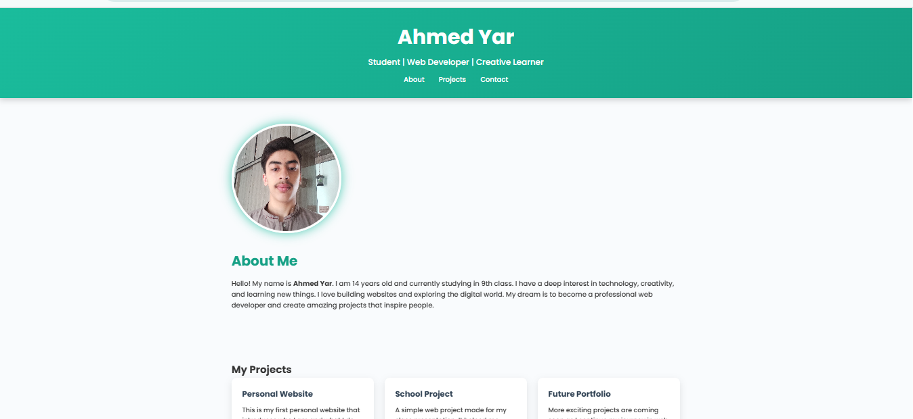

# Ahmed Yar — Portfolio Website

🌐 Personal Portfolio Website of **Ahmed Yar** | 14-year-old student & aspiring web developer.  
Showcasing my biography, projects, and contact details. Built with HTML & CSS.

**Live demo:** https://abdulhadinawaz1979-cyber.github.io/ahmedyar-portfolio/

---

## About
Hello — I’m **Ahmed Yar**, a motivated and creative student (Class 9) who loves building websites and learning new technologies. This portfolio shows my projects, skills, and how to contact me.

---

## Features
- Clean, responsive portfolio layout  
- About, Projects and Contact sections  
- Profile photo and contact button (email link)  
- Easy to edit HTML/CSS files  

---

## Tech
- HTML5  
- CSS3  
- (Optional) JavaScript for animations  

---

## How to view
- **Locally:** open `index.html` in a browser (double-click the file).  
- **Online:** visit the live demo URL above.  

---

## Preview
(
 

---

## Contact
✉️ Email: **meahmedkhanyar@gmail.com**

---

## License
This project is open and free to view. © 2025 Ahmed Yar.
